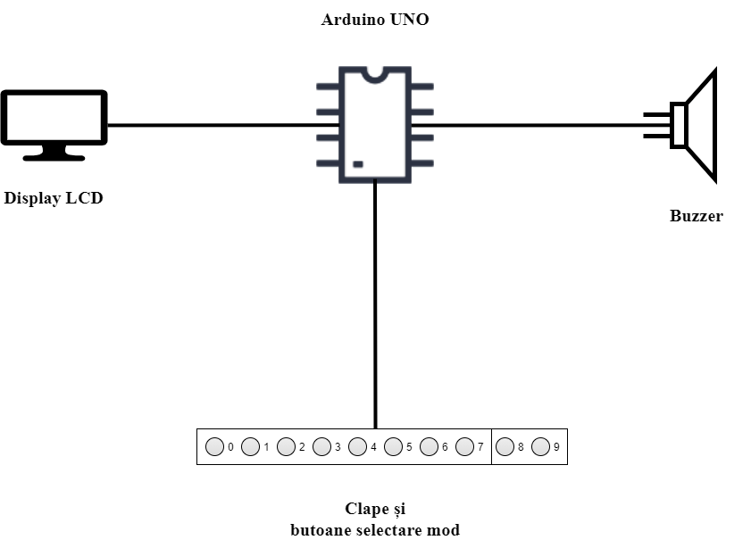
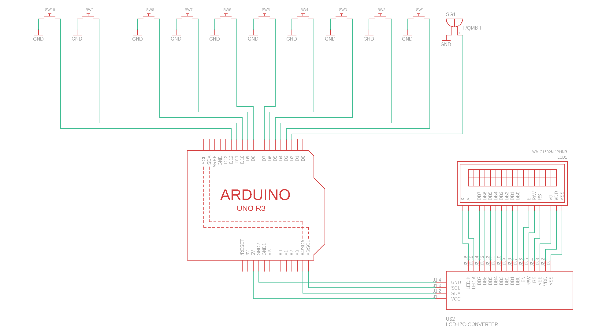
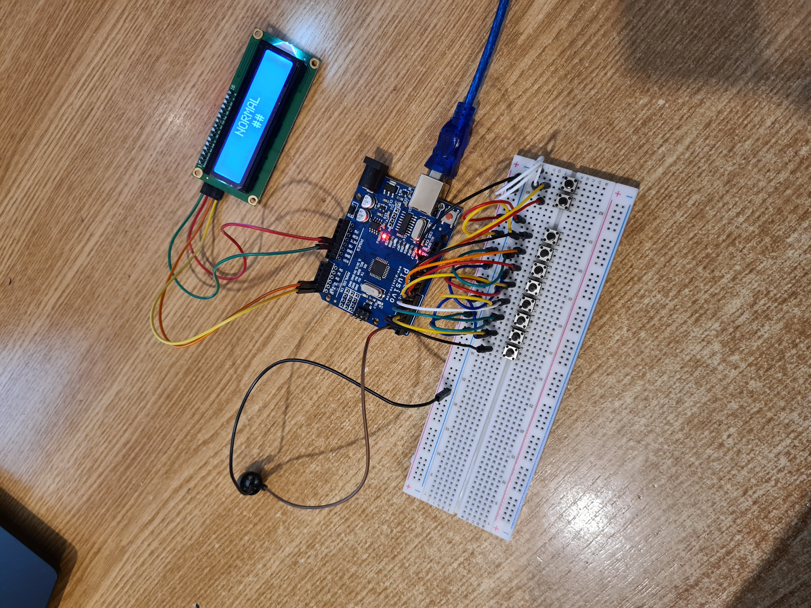

Nume: Drăgulin Liviu-Mihai

Grupă: 334CC

Materie: Proiectarea cu Microprocesoare

# LCD Piano

## Introducere
Proiectul constă în împlementarea unui pian cu 8 clape și 2 butoane de schimbare a modului. Pianul va avea trei moduri: NORMAL, RECORD și LISTEN.

## Descriere generală
La placa Arduino vor fi conectate 10 butoane (8 reprezentând clapele pianului și 2 reprezentând butoanele ce schimbă modul în care se află pianul), un buzzer pasiv ce va reda sunetele clapelor și un display lcd 1602 cu modul I2C. De asemenea, melodia înregistrată va fi salvată în EEPROM, lucru care face ca melodia să rămână salvată chiar și după întreruperea alimentării.

### Schema bloc

## Hardware Desige
### Listă de piese
  * Arduino Uno
  * Breadboard
  * Cablu USB
  * Fire de legatura
  * LCD 1602 cu modul I2C
  * 10 butoane
  * Buzzer

### Schemă electrică

## Software Design
> Buzzer-ul cred că are mici probleme. I-am dat să repete aceeași notă încontinuu, iar cateodată sunetul diferă.

 Cele 8 clape ale pianului sunt reprezentate de 8 butoane care sunt conectate la pinii 3-10 în modul INPUT_PULLUP. Datorită modului INPUT_PULLUP, butoanele nu au nevoie de rezistențe. Butoanele cu care se schimbă modurile pianului sunt conecate la pinii 11, respectiv 12 tot în modul INPUT_PULLUP. Buzzer-ul este conectat la pin-ul 2; redarea sunetului se face cu ajutorul funcției **tone**.
Comunicarea cu display-ul LCD 1602 se face cu ajutorul modului I2C (SDA se conectează la pinul A4, iar SCL la pinul A5) prin intermediul bibliotecii LiquidCrystal_I2C.h care are la rândul ei nevoie de biblioteca Wire.h. Utilizarea EEPROM-ului se realizează cu ajutorul bibliotecii EEPROM.h. Pe prima linie a display-ului este afișat modul în care se află pianul (NORMAL, RECORD, LISTEN), iar pe a doua linie este afișat:
  * ultima clapă apăsată

 SAU

  * \## - atunci când nu există  tastă precedentă apăsată sau când pianul se află în modul LISTEN

 SAU

  * oo - atunci când înregistrarea melodiei a început în modul RECORD

Când pianul este în modul RECORD, melodia înregistrată precedent nu este ștearsă imediat, trebuie apăsată oricare clapă pentru a începe înregistrarea și ștergerea melodiei memorate înainte.
În modul LISTEN, clapele pianului sunt dezactivate. Singurele butoane ce pot fi apăsate sunt cele de schimbare a modului în care se află pianul.

### Funcții implementate
  * **lcd_change_line** - funcție ce schimbă o linie a buffer-ului intern programului, în care este memorat conținutul celor două linii ale lcd-ului, în funcție de ce buton este apăsat și marcheză că liniile display-ului trebuie actualizate
  * **play_note** - funcție ce redă sunetul clapei apăsate
  * **start_recording** - funcție ce începe memorarea secvenței de clape apăsate
  * **save_song** - funcție ce salvează în EEPROM lungimea melodiei și melodia în sine
  * **save_note** - funcție ce salvează în buffer-ul intern al programului ultima clapă apăsata, iar dacă s-a atins lungimea maximă a cântecului, melodia este salvată în EEPROM (cu ajutorul funcției anterioare), înregistrarea melodiei este oprită și modul pianului este schimbat
  * **read_buttons_state** - funcție ce citește starea butoanelor (LOW == buton apăsat)
  * **compute_buttons_state** - funcția ce se ocupă de acțiunile ce trebuie făcute atunci când se apasă un anumit buton
  * **setup** - funcția ce inițializează interfața serială, inițializează pin-urile aferente butoanelor, încarcă melodia din EEPROM în buffer-ul intern programului și inițializează lcd-ul
  * **loop** - funcția principală în care se citește starea butoanelor, se execută acțiunile aferente apăsării anumitor butoane și se actualizează display-ul în cazul unei modificări

## Rezultate Obţinute
[GitHub](https://github.com/liviumdragulin/lcd_piano)

[Video](https://drive.google.com/file/d/1JBiFXFTjniZ8-KLuL_Kb1RiKoZthYCIC/view)

## Bibliografie/Resurse
https://www.arduino.cc/reference/en/language/functions/advanced-io/tone/

https://pages.mtu.edu/~suits/notefreqs.html

https://create.arduino.cc/projecthub/Arnov_Sharma_makes/lcd-i2c-tutorial-664e5a

https://www.optimusdigital.ro/ro/optoelectronice-lcd-uri/62-lcd-1602-cu-interfata-i2c-si-backlight-galben-verde.html

https://www.arduino.cc/en/Reference/LiquidCrystal

https://www.arduino.cc/en/Reference/EEPROM

https://github.com/arduino/ArduinoCore-avr/blob/master/libraries/EEPROM/src/EEPROM.h

https://www.tinkercad.com/